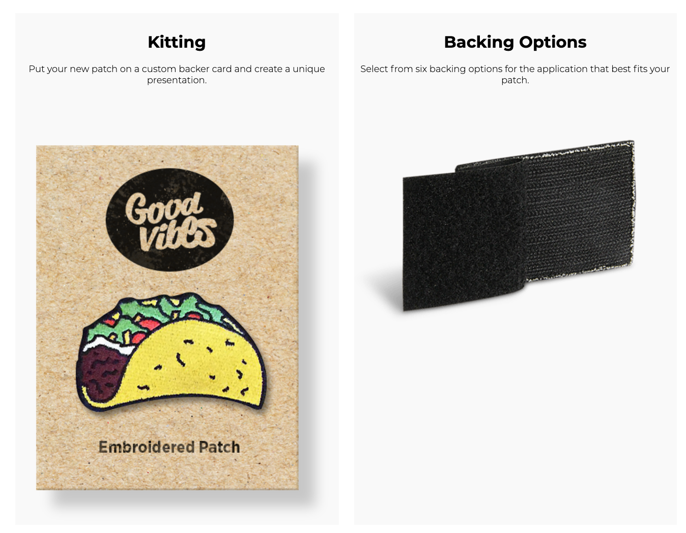

[Season Cover]

# RAW - KANNIBAL SEASON [00RAW]

**/// (1st Season) Time Destination: 2020**

"KANNIBAL_RAW_SEASON"
- create a banner for Raw Season
- create a main video (Presentation of the products. showreel. 50min. kannibal orientation program)
- create a cut out videos (segments, 6min per product).
- create quick short snippets for socials (15sec, 60 sec)

## Projects to consider for starters:**

---

### ZEROSUM ELEMENTS [Patch Series]

Inspired: https://aokuware.com/products/161900

Product Description:
Series Tag:
Amount of Variations: 4

- basic slim hc
- square hc
- kannibal cutout slim
- kannibal slim

Aoku - description - reasearch the rest of the brands for lingo motifs. Or create your own lingo - preferred option to go with.

```
2019 PATCH CUSTOMIZATION UNITS
[80x25mm VELCRO PATCH]
EACH DESIGN PRODUCED IN EDITION OF 100 TOTAL (not 02/04). RELEASED IN TWO BATCHES AVAILABLE ONLY TILL 23-12-2018/23:59CET. WILL NOT BE REPRODUCED. EVERY PATCH ORDER COMES WITH ∆OKU STICKER SHEET. PATCHES COME WITH SELF-ADHESIVE(P14) FLEECE COUNTERPART [you can create your own patch array/customize gear/securing loop part with few stitches recommended].

161901/03/05/06/07/08 CONSTRUCTION:

0.7mm POLYAMID WEBBING
HOOK BACKING
SELF-ADHESIVE VELCRO® BRAND FLEECE TAPE (P14 GLUE)

161902 CONSTRUCTION:

76x50mm EMBROIDED PATCH IN A SIZE OF STANDARD MILITARY FLAG PATCHES
HOOK BACKING
SELF-ADHESIVE VELCRO® BRAND FLEECE TAPE (P14 GLUE)

161904 CONSTRUCTION:

MATTE BLACK SILICONE BASE WITH GLOW-IN-THE-DARK[GID] AA-ERSTL-XX LOGO
HOOK BACKING
SELF-ADHESIVE VELCRO® BRAND FLEECE TAPE (P14 GLUE)
```

---

### Kannibal flagship stealth patch with RFID

Product Description:
Series Tag:
Amount of Variations:

---

### Hitech Crime patch minimal b&w

Product Description:
Series Tag:
Amount of Variations:

---

### Autonomous LED light patches (babel_infocalypse)

Product Description:
Series Tag:
Amount of Variations:

---

### DIY Platform for people to make their own designs.

Product Description:
Series Tag:
Amount of Variations:

---

### Velcro Chest Patch (Military Style)

swap depending on the project you're working on (Helve, Kannibal, Hitech Crime)

Product Description:
Series Tag:
Amount of Variations:

---

### Velcro Underchin Jacket Patch platform (nod towards Acrnm style)

Product Description:
Series Tag:
Amount of Variations:

---

### 9012-HUG tagname: Hugger

add as a product: 9012-HUG tagname: Hugger / The sweetest of our products in terms of pure intentions factor. Slide-on Patch Platform to tuck in whereever you need them (Elastic Platform with Velcro connection on it, synthetically spring-loaded)

Product Description:
Series Tag:
Amount of Variations:

### Stencils?

Product Description:
Series Tag:
Amount of Variations:

### **Rubber Velcro Patches!** want at least one to just try how it feels. if not full rubber then consider glued rubber cutouts.

Product Description:
Series Tag:
Amount of Variations:

### Initiation / Show How To Make Your Own Things / Cannibalize Wear and Tech: 
  ```
  Evo Attachment Extension - conversion kit to "kannibalize" other bags and items so they can be used as modular.
   ```
Product Description:
Series Tag:
Amount of Variations:
   
### basic testing products, fairly simple to make, wide variety of design to test (minimal, stealth but raw)

Product Description:
Series Tag:
Amount of Variations:

### Distribution Idea - "Velcro Card" with additional info

Product Description:
Series Tag:
Amount of Variations:



## [ZEROSUM ELEMENTS] Patch Series 

**First Test Set** (Design Required)
- [ ] **01 HITECH CRIME RAW00_BW-HC**

``` Basic Hitech Crime Patche / slim 76x25mm / white sewn on black / velcro back  ```


  
- [ ] 02 HITECH CRIME RAW00_RW-HC

``` Basic Hitech Crime Patch / slim 76x25mm / white on blood red / velcro back ```
  
- [ ] **03 KANNIBAL RAW00_BW-K**

``` Basic Kannibal Patch / slim 76x25mm / white sewn on black / velcro back ```
  


- [ ] **04 KANNIBAL RAW00_BW-KCO (logo cut out)

``` Basic Kannibal Patch / slim 76x25mm / white sewn on black / velcro back ```
  

  
- [ ] 04 KANNIBAL RAW00_BW-CO (logo cut out 76x50mm)

``` Basic Kannibal Patch / wide 76x50mm / white sewn on black / velcro back ```

- [ ] 05 HELVE AVR PATCH 76x50mm logo only

``` type name / size, mm / color pattern / velcro back ```
  
- [ ] 06 HELVE AVR PATCH 76x50mm with "AVR" subtitle

``` type name / size, mm / color pattern / velcro back ```
  
- [ ] 07 HELVE/HITECH/KANNIBAL TRYPTIC PATCH (vertical patch) 76x50mm

``` type name / size, mm / color pattern / velcro back ```
  
- [ ] **08 HITECH CRIME b&w 45mm x  45mm (back of the cap)** < active test

``` Square Hitech Crime Patch / square 45mmx45mm / white on black / velcro back ```
  

  
- [ ] **09 CBD REGIME [CBD Series] 76mm x  25mm** < active test

``` type name / size, mm / color pattern / velcro back ```

- [ ] **10 TACTICAL DROP SQUAD**  [CBD Series] < active test


# **Short Film Orientation**

## Video Longform

- presentation of the products. showreel. 50min. kannibal orientation program)

## Shortform (6min)

- create a cut out videos (segments, 6min per product).

## Shortform (6min)

- create a cut out videos (segments, 6min per product). 

## Microform (15sec/60sec)

- create quick short snippets for socials (15sec, 60 sec)

RAW KANNIBAL EXPERIENCE

**Silly version** (classic attention shift)
Some commotion on the street.
"What are they doing?"
"It's the raw season."
"Oh yeah."
Camera unveils a group of people ripping clothes from on themselves.


